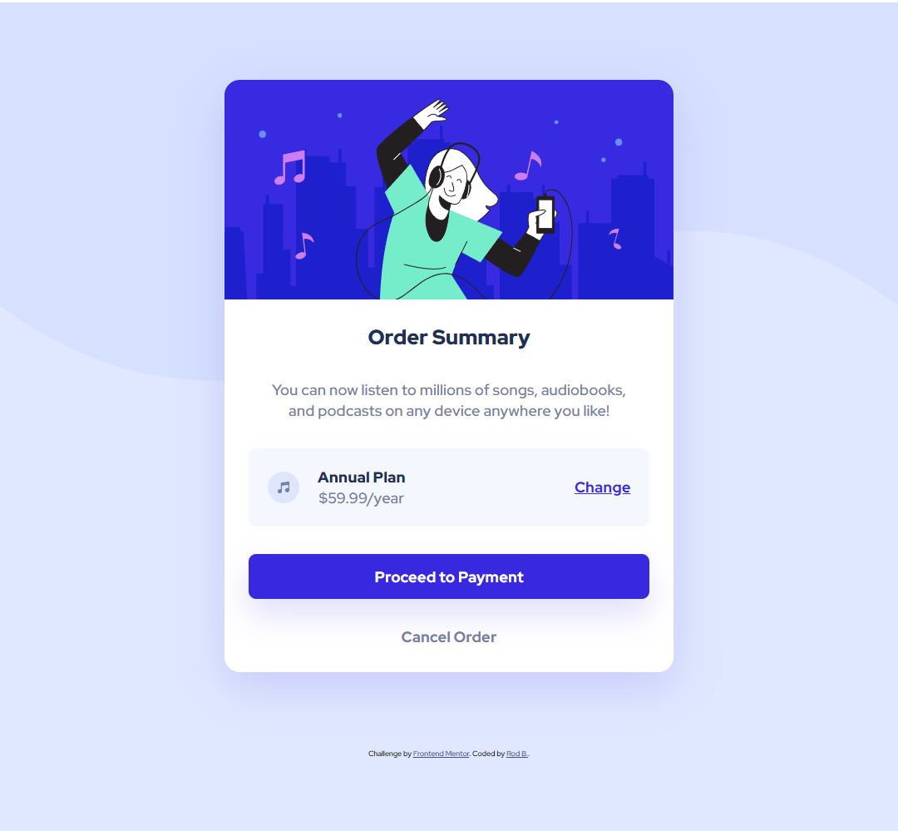

# Frontend Mentor - Order summary card solution

This is a solution to the [Order summary card challenge on Frontend Mentor](https://www.frontendmentor.io/challenges/order-summary-component-QlPmajDUj). Frontend Mentor challenges help you improve your coding skills by building realistic projects.

## Table of contents

- [Overview](#overview)
  - [The challenge](#the-challenge)
  - [Screenshot](#screenshot)
- [My process](#my-process)
  - [Built with](#built-with)
  - [What I learned](#what-i-learned)
- [Author](#author)

## Overview

### The challenge

Users should be able to:

- See hover states for interactive elements

### Screenshot



Screenshot of the render for a 1080 by 1777px viewport (vertical).

## My process

### Built with

- Semantic HTML5 markup
- CSS custom properties
- Flexbox
- Mobile-first workflow

### What I learned

I started with the styles for the mobile version to see how it looks on small screens, then scaled it up to the desktop version. What I learned is that you can keep measurements relative to a base and then just change the base as screen sizes increase so that the output scales up rather smoothly:

```css
:root {
  font-size: 16px;
}
```

The mobile styles start with a font-size of 16px. Flex gaps, paddings, and margins are relative to this font-size via rems. And at certain breakpoints I adjust the base font-size:

```css
@media (min-width: 992px) {
  :root {
    font-size: 17px;
  }

  body {
    background-image: url(images/pattern-background-desktop.svg);
  }
}
@media (min-width: 1440px) {
  :root {
    font-size: 21px;
  }
}
```

## Author

- LinkedIn - [Rod](https://www.linkedin.com/in/rodnel-bague-953274202/)
